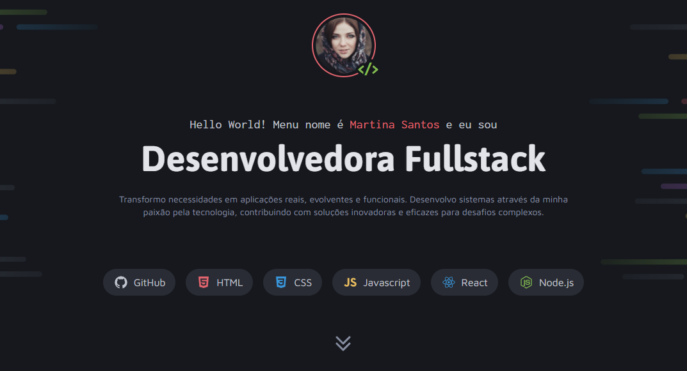

# Desafio prático - Portfólio Dev

Projeto realizado no segundo desafio da formação Full-Stack da Rocketseat por Francisco Bianchi!

## Conceitos que foram praticados com esse projeto

- Criação de layouts com CSS
- Posicionamento de elementos
- Variáveis CSS
- CSS Flexbox
- CSS Grid
- pseudo-class e pseudo-elements
